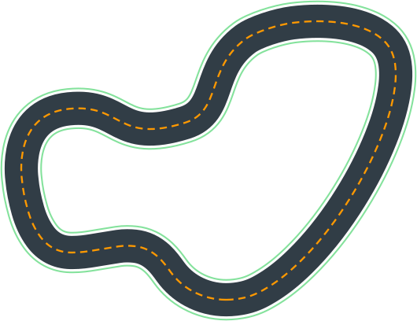
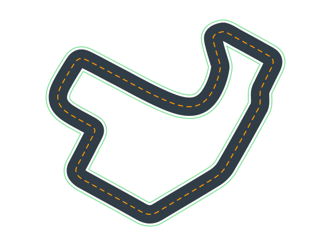

# Desafios
Olá e bem-vindos à nossa seção de desafios!

Agora que você já domina a teoria por trás da função de recompensa, dos algoritmos de aprendizado e dos hiperparâmetros, é hora de colocar a mão na massa. A melhor forma de aprender a otimizar um modelo no DeepRacer é através da prática e da experimentação.

Cada desafio a seguir foi projetado para focar em conceitos específicos, permitindo que você observe diretamente como as mudanças na função de recompensa e nos hiperparâmetros afetam o desempenho do seu carro.

## Desafio 1

Neste primeiro desafio o objetivo principal é fazer um carro que consigua completar a pista.

- **Horas de treino**: 2
- **Espaço de ação**: discreto
- **Algoritimo de aprendizado**: PPO
- **Hiperparâmetros**: padrão
- **tipo de corrida**: time trial
- **cameras e sensores**: camera unica
- **Pista**: Smile Speedway

Quanto à função de recompensa, minha dica é: comece pela página de exemplos da AWS. Em vez de simplesmente copiar um código, use-o como inspiração. O verdadeiro aprendizado acontece quando você monta a sua própria função. Pegue um pedaço de um exemplo, combine com outro e crie algo único. Sentar e "quebrar a cabeça" é a parte mais importante do processo, pois é o que vai aprimorar sua capacidade de criar soluções.

([Link](https://docs.aws.amazon.com/deepracer/latest/developerguide/deepracer-reward-function-input.html))

Resultados esperados:

- O modelo deve estar sendo capaz de completar a pista
- Tempo minimo: <!-- a ser testado -->
## Desafio 2

## Desafio 3

## Desafio 4

## Desafio 5