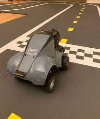
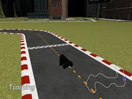
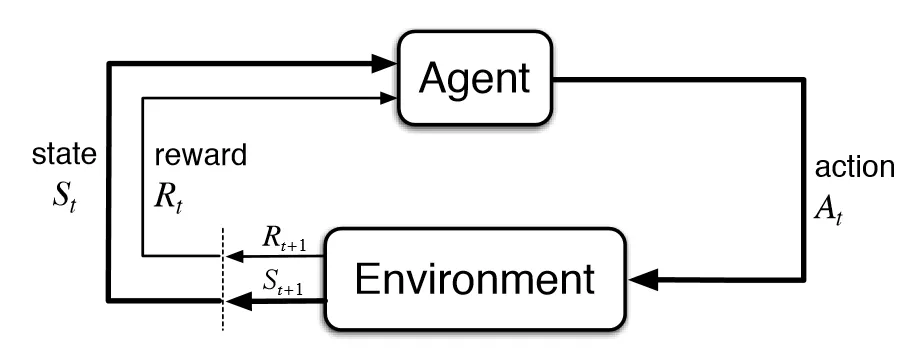
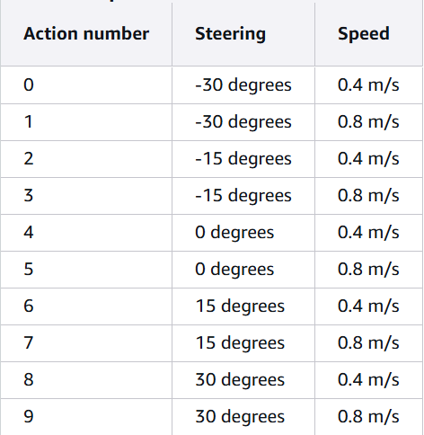

# Introdução ao DeepRacer

## Oque é o DeepRacer?

AWS DeepRacer é uma plataforma que permite aos usuários aprender e experimentar o aprendizado por reforço (RL) por meio de um carro de corrida autônomo em escala 1/18. Ele fornece um simulador de corrida 3D baseado em nuvem para treinar modelos de RL e um carro físico real para implantação. Os usuários podem treinar seus modelos no simulador, avaliá-los e, em seguida, implantá-los no carro físico para direção autônoma no mundo real.

O DeepRacer também oferece uma liga de corrida onde os usuários podem competir com seus modelos.

**Carro fisico**

**Simulador**

### Tipos de Corrida

- **Contrarrelógio**: corra contra o relógio em uma pista desobstruída com o objetivo de obter o tempo de volta mais rápido possível.

- **Desvio de objetos**: corrida contra o relógio em uma pista com obstáculos estacionários e com o objetivo de obter o tempo de volta mais rápido possível.

- **Head-to-bot corrida**: corra contra um ou mais veículos na mesma pista e tente cruzar a linha de chegada antes de outros veículos.

Atualmente, as corridas DeepRacer comunitárias da AWS oferecem suporte apenas para contrarrelógio.

### Aprendizado por reforço

Aprendizagem por reforço (RL) é um tipo de aprendizado de máquina onde um agente aprende a tomar decisões em um ambiente para maximizar uma recompensa cumulativa. É como ensinar um sistema por tentativa e erro, onde ações que levam a resultados positivos são reforçadas, e aquelas que levam a resultados negativos são desencorajadas.

**Agente**: A entidade que aprende e age dentro do ambiente.

**Ambiente**: O contexto no qual o agente opera, fornecendo feedback com base nas ações do agente.

**State** (S): Representam os diferentes estados em que o agente pode estar.

**Actions** (A): Representam as ações que o agente pode fazer em cada estado.

**Rewards** (R): O feedback recebido pelo agente após realizar uma ação em um estado.

**Características de Aprendizado por Reforço:**

- Aprendizagem por tentativa e erro: O agente explora o ambiente, experimentando diferentes ações e aprendendo com as recompensas resultantes.

- Reforço ao longo do tempo: O agente aprende a associar ações a recompensas que podem ser recebidas no futuro, e não apenas imediatamente.

- Orientado a objetivos: O agente aprende a tomar decisões que otimizam um objetivo específico, conforme definido pela função de recompensa.

### Markov Decision Process (MDP)

**Markov Decision Process (MDP)** é uma estrutura matemática usada em aprendizado por reforço para modelar a tomada de decisões sequenciais em ambientes dinamicos. Ele fornece uma maneira estruturada de representar situações em que um agente interage com um ambiente, tomando ações que influenciam seu estado e recebendo recompensas correspondentes.

**State (St)**: Representa a situação ou configuração atual do ambiente no tempo t.

**Action (At)**: A decisão que o agente toma no tempo t no estado recebido.

**Reward (Rt+1)**: Um valor numérico dado pelo ambiente ao agente como feedback por tomar a ação At no estado St. Este é recebido no tempo t+1.

**Transition (St+1)**: O novo estado para o qual o ambiente transita após o agente tomar a ação At no estado St.

**Time Step (t)**: Pontos discretos no tempo em que o agente interage com o ambiente.

Como ler o MDP:

Em cada instante de tempo (t), o Agente observa o estado atual (St) do Ambiente. Com base nesse estado, o Agente decide e executa uma ação (At), que é enviada ao Ambiente. Em resposta à ação, o Ambiente transita para um novo estado (St+1) e gera uma recompensa (Rt+1). Tanto o novo estado quanto a recompensa são então enviados de volta ao Agente, que usa essas informações para aprender a tomar decisões futuras, visando maximizar a soma das recompensas ao longo do tempo, repetindo o ciclo para o instante de tempo seguinte (t+1).

### Espaço de ação

No aprendizado por reforço, o conjunto de todas as ações válidas, ou escolhas, disponíveis para um agente ao interagir com um ambiente é chamado de espaço de ação. No console AWS DeepRacer, você pode treinar agentes em um espaço de ação discreto ou contínuo.

Um **espaço de ação discreto** representa todas as possíveis ações de um agente para cada estado em um conjunto finito. Para o AWS DeepRacer, isso significa que, para cada situação ambiental incrementalmente diferente, a rede neural do agente seleciona uma velocidade e uma direção para o carro com base nas informações de sua(s) câmera(s) e no sensor LiDAR (opcional). A escolha é limitada a um agrupamento de combinações predefinidas de ângulo de direção e valores de aceleração.

Um **espaço de ação contínuo** permite que o agente selecione uma ação dentre uma gama de valores para cada estado. Assim como em um espaço de ação discreto, isso significa que, para cada situação ambiental incrementalmente diferente, a rede neural do agente seleciona uma velocidade e direção para o carro com base na entrada de sua(s) câmera(s) e (opcional) sensor LiDAR. No entanto, em um espaço de ação contínuo, você pode definir a gama de opções dentre as quais o agente escolhe sua ação.

**Discreto vs. Contínuo**

A vantagem de usar um espaço de ação contínuo é que você pode escrever funções de recompensa que treinam modelos para incentivar ações de velocidade/direção em pontos específicos de uma pista, otimizando o desempenho. Escolher entre uma variedade de ações também cria o potencial para mudanças suaves nos valores de velocidade e direção que, em um modelo bem treinado, podem produzir melhores resultados em condições reais.

No cenário de espaço de ação discreto, limitar as escolhas de um agente a um número finito de ações predefinidas coloca sobre você a responsabilidade de entender o impacto dessas ações e defini-las com base no ambiente (pista, formato de corrida) e suas funções de recompensa. No entanto, em um cenário de espaço de ação contínuo, o agente aprende a escolher os valores ideais de velocidade e direção a partir dos limites mínimo/máximo que você fornece por meio do treinamento.

Embora fornecer uma gama de valores para o modelo escolher pareça ser a melhor opção, o agente precisa treinar por mais tempo para aprender a escolher as ações ideais. O sucesso também depende da definição da função de recompensa.

### Policy

Em aprendizagem por reforço, uma **política** é uma estratégia ou conjunto de regras que um agente usa para decidir quais ações tomar em diferentes estados de um ambiente. Ela essencialmente mapeia observações (estados) em ações, guiando o agente sobre o que fazer. O objetivo de uma política é maximizar a recompensa cumulativa que o agente recebe ao longo do tempo.

A policy pode ser usada em algoritimos de aprendizado por reforço, os dois algoritimos usados pelo DeepRacer são **PPO (Proximal Policy Optimization)** e **SAC (Soft Actor-Critic)**

**PPO (Proximal Policy Optimization)**: Este é o algoritmo padrão e mais frequentemente usado no DeepRacer. É conhecido por sua estabilidade e bom desempenho em uma variedade de tarefas. O PPO é um algoritmo "on-policy", o que significa que ele aprende com os dados que coleta enquanto segue a política atual.

**SAC (Soft Actor-Critic)**: O SAC é outro algoritmo de Reinforcement Learning que pode ser usado. Ele é conhecido por ser mais eficiente em termos de dados e pode ser bom para exploração, mas pode ser mais sensível à sintonia de hiperparâmetros. O SAC é um algoritmo "off-policy", o que significa que ele pode aprender com experiências passadas, mesmo que essas experiências não tenham sido geradas pela política atual.

Embora o SAC seja uma opção disponível, ele é muito sensível a hiperparâmetros, e isso fez com que seja muito dificil treinar um modelo estavel.

É recomendado manter a PPO, especialmente se você for iniciante.

### Hyperparametros

Os hiperparâmetros do DeepRacer são configurações ajustáveis que controlam o processo de treinamento do modelo de Reinforcement Learning, e não o próprio modelo. Eles são definidos antes do início do treinamento e permanecem fixos durante todo o processo.

Pense neles como os "botões" ou "alavancas" que você ajusta para guiar o algoritmo de aprendizado. Eles influenciam diretamente como o modelo aprende, a velocidade com que aprende, a estabilidade do treinamento e a qualidade final da política (o comportamento do carro).

Em termos gerais, os hiperparâmetros incluem:

- Configurações do Algoritmo de RL: Parâmetros específicos do algoritmo de Reinforcement Learning escolhido (PPO ou SAC), como taxa de aprendizado, entropia, tamanho do lote, etc.

- Configurações da Rede Neural: Parâmetros relacionados à arquitetura da rede neural que representa a política, como o número de camadas ocultas, o número de nós em cada camada e a função de ativação.

- Configurações do Ambiente de Simulação: Parâmetros que afetam a interação entre o agente e o ambiente, como o tempo máximo de um episódio de treinamento ou o tamanho do "buffer de experiência".

Ajustar os hiperparâmetros é um processo crucial, muitas vezes iterativo (exigindo experimentação), que visa encontrar a combinação ideal que resulta em um modelo de carro autônomo robusto e rápido na pista.

Você pode ler mais sobre cada um dos hyperparametros no site da AWS

Link para a pagina oficial da AWS explicando cada um dos hyperparametros ([Link](https://docs.aws.amazon.com/deepracer/latest/developerguide/deepracer-console-train-evaluate-models.html#deepracer-iteratively-adjust-hyperparameters))

## Reward Function

A função de recompensa no DeepRacer é, em essência, o coração do processo de aprendizagem por reforço. Ela é um script Python que você escreve e que define como o carro será "recompensado" ou "penalizado" a cada passo que ele dá na pista.

O objetivo principal da função de recompensa é guiar o agente (o carro) a aprender o comportamento desejado, que é completar a pista o mais rápido possível sem sair dela.

Aqui estão os pontos chave sobre a função de recompensa:

**Entradas**: A função de recompensa recebe dados do ambiente a cada passo, como:

- Coordenadas do carro na pista, Ângulo de direção do carro, Velocidade atual do carro, Ângulo de viragem do carro, Distância do carro ao centro da pista, etc.

**Saída**: A função deve retornar um único valor numérico (um float) que representa a recompensa para o passo atual.

- **Recompensas Positivas**: Você atribui recompensas positivas para comportamentos desejáveis (ex: manter-se no centro da pista, aumentar a velocidade, completar mais progresso).

- **Recompensas Negativas** (Penalidades): Você atribui recompensas negativas ou penalidades para comportamentos indesejáveis (ex: sair da pista, bater, virar excessivamente).

O algoritmo de Reinforcement Learning usa esses valores de recompensa para ajustar a política do carro. O objetivo é aprender uma política que maximize a soma total das recompensas ao longo do tempo. Uma função de recompensa bem projetada é crucial para o sucesso do treinamento, pois ela molda diretamente o que o carro aprenderá a fazer.

### Parametros

Existem diversos parametros que podem ser usados para montar uma função de recompensa, por exemplo:

- x, y: Coordenadas do carro na pista.

- heading: Ângulo de direção do carro.

- speed: Velocidade atual do carro.

- steering_angle: Ângulo de viragem do carro.

- distance_from_center: Distância do carro ao centro da pista.

- is_offtrack, is_crashed: Flags booleanas indicando se o carro saiu da pista ou colidiu.

- all_wheels_on_track: Flag booleana indicando se todas as rodas estão na pista.

- progress: Percentagem da pista completada.

- waypoints: Uma lista de coordenadas que definem o caminho da pista.

- etc

Você pode ler mais sobre cada um dos parametros no site da AWS

Link para a pagina oficial da aws explicando os parametros com exemplos de funções de recompensas ([Link](https://docs.aws.amazon.com/pt_br/deepracer/latest/developerguide/deepracer-reward-function-input.html))

## Treinamento e Avaliação de Modelos

<!-- adicionar imagens mostrando o passo a passo para a criação, treinamento e avaliação de um modelo  -->

# Aprofundamento no DeepRacer

## Otimização da função de recompensa

## Otimização do Espaço de Ação

## Arquitetura do Serviço AWS DeepRacer

## Importe e exporte modelos no DeepRacer console da AWS

## Analise de logs

### Para contas padrões

### Para contas de estudantes